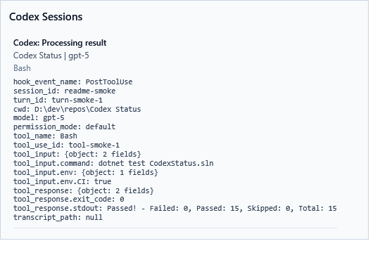

# Codex Status for Windows

Codex Status is a small Windows tray utility for monitoring active Codex sessions.
It listens to Codex lifecycle hooks, writes a normalized local status file, and
shows that status in a tray icon, floating pill, and session flyout.

The goal is simple: make it obvious when Codex is thinking, running a command,
editing files, waiting for approval, compacting context, using a subagent, or
done.



## Features

- Windows notification-area icon for idle, active, approval, done, failed, and stale states.
- Optional floating pill above the taskbar with status and elapsed time.
- Session flyout that shows all tracked sessions and the latest hook stdin payload fields.
- Hook installer for Codex lifecycle events.
- Local state files under `%USERPROFILE%\.codex\statusbar` by default.
- Settings for command-text hiding, secret redaction, sounds, startup, state path, and pill behavior.
- Best-effort failure isolation: malformed hook input is logged locally and does not break Codex.

## Requirements

- Windows
- .NET 10 SDK to build from source
- Codex with lifecycle hooks enabled

Codex may ask you to review and trust hooks after installation or after hook definitions change.
This app does not bypass Codex hook trust.

## Quick Start

Build and publish the app:

```powershell
.\scripts\publish.ps1
```

Run the tray app:

```powershell
.\artifacts\publish\CodexStatus.Tray\CodexStatus.Tray.exe
```

Then install the Codex hooks:

1. Right-click the Codex Status tray icon.
2. Choose `Reinstall Codex hooks`.
3. Start a new Codex session.
4. If Codex prompts you to review or trust the hook, approve it.

Once hooks are trusted, double-click the tray icon or click the floating pill to open the session flyout.

## What Reinstall Hooks Does

The tray menu item `Reinstall Codex hooks`:

1. Copies the published hook files into:

   ```text
   %USERPROFILE%\.codex\statusbar\hook
   ```

2. Adds or updates handlers in:

   ```text
   %USERPROFILE%\.codex\hooks.json
   ```

The installer registers these Codex events:

- `SessionStart`
- `UserPromptSubmit`
- `PreToolUse`
- `PermissionRequest`
- `PostToolUse`
- `PreCompact`
- `PostCompact`
- `SubagentStart`
- `SubagentStop`
- `Stop`

If `hooks.json` already exists and needs changes, the installer creates a timestamped backup first.
It does not remove your other hooks.

## Privacy and Local State

Codex Status is local-only. It does not send status data anywhere.

By default it writes state under:

```text
%USERPROFILE%\.codex\statusbar
```

Important files:

- `state.json`: aggregate status consumed by the tray app
- `sessions\<session_id>.json`: latest status for each session
- `events.jsonl`: compact event log for debugging
- `codex-status.log`: local hook/app log

The app uses hook payloads and normalized local state only. It does not scrape private reasoning,
Codex UI internals, or transcript contents. When `transcript_path` is present in a hook payload,
the path may be stored as metadata, but the transcript file is not read.

Settings that affect privacy:

- `Hide command text`: hides command fields such as `tool_input.command` in tray payload display.
- `Redact secrets`: applies best-effort masking for obvious API keys, tokens, passwords, and bearer headers.

## Settings

Open the tray menu and choose `Settings`.

Available settings include:

- Show or hide the floating pill.
- Keep the pill always on top.
- Play sounds when Codex finishes or waits for approval.
- Hide command text in display fields.
- Redact obvious secrets from stored previews.
- Start with Windows.
- Change the Codex home path.
- Change the state directory.

## Development

Build everything:

```powershell
.\scripts\build.ps1
```

Run tests:

```powershell
dotnet test CodexStatus.sln
```

Create self-contained win-x64 publish outputs:

```powershell
.\scripts\publish.ps1
```

Publish output is written under:

```text
artifacts\publish
```

## Project Layout

```text
src\CodexStatus.Core        Shared reducer, state, settings, hook installer
src\CodexStatus.Hook        Command hook executable invoked by Codex
src\CodexStatus.Tray        WPF tray app and floating pill
src\CodexStatus.ExecAdapter Experimental adapter for exec JSON events
tests\CodexStatus.Tests     Unit tests
docs                        Hook, state, WSL, and development notes
scripts                     Build and publish scripts
```

## Known Limitations

- Hooks do not expose every internal Codex UI state.
- Some non-shell and non-MCP activity can only be shown as generic tool usage.
- WSL Codex CLI usage needs additional setup. See [docs/wsl.md](docs/wsl.md).
- The exec adapter is a future integration point and is not the primary v1 path.

## Documentation

- [Hook behavior](docs/hooks.md)
- [State schema](docs/state-schema.md)
- [WSL setup notes](docs/wsl.md)
- [Development notes](docs/development.md)
